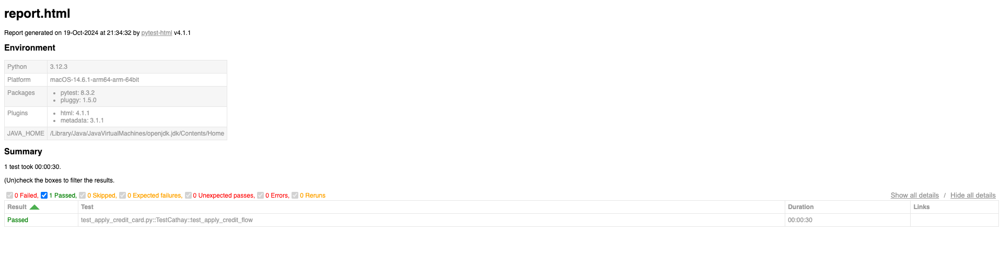

# This is Cathay Apply Credit flow test
- The test is based on Selenium using ChromeDriver, with the Chrome window size set to simulate mobile behavior.

### Before running the test, you need to download the ChromeDriver that matches your environment.
- Download [ChromeDriver](https://developer.chrome.com/docs/chromedriver/downloads?hl=zh-tw)
- after download ChromeDriver ,Please add the ChromeDriver location to the PATH environment variable. 

### Make sure that the Python version in your environment is 12 or higher. If not, please download it from the official Python website.
- [Python official website](https://www.python.org/downloads/)

## Install the required packages with PIP
```
cd cathaybkAutoTest
pip install -r requirements.txt
```
## Run the Test
```
cd cathaybkAutoTest
python3.12 -m pytest --html=reports/report.html tests/test_apply_credit_card.py  --env=cathayRel
```
- The parameter `env` is defined for different test environments; currently, it only supports the online environment.
- The screenshots will be saved in ./cathaybkAutoTest/screenshots.
- The log wil be saved in ./cathaybkAutoTest/logs
```
2024-10-19 21:34:04 config.py:11 [INFO]: ConfigManager Test ENV cathayRel
2024-10-19 21:34:10 creditcard.py:26 [INFO]: credit card item is 卡片介紹
2024-10-19 21:34:10 creditcard.py:26 [INFO]: credit card item is 刷卡優惠
2024-10-19 21:34:10 creditcard.py:26 [INFO]: credit card item is 小樹點(信用卡)
2024-10-19 21:34:10 creditcard.py:26 [INFO]: credit card item is 卡友登錄專區
2024-10-19 21:34:10 creditcard.py:26 [INFO]: credit card item is 卡友理財服務
2024-10-19 21:34:10 creditcard.py:26 [INFO]: credit card item is 卡友權益
2024-10-19 21:34:10 creditcard.py:26 [INFO]: credit card item is 行動支付
2024-10-19 21:34:10 creditcard.py:26 [INFO]: credit card item is 申請信用卡
2024-10-19 21:34:10 creditcard.py:26 [INFO]: credit card item is 掛失信用卡
```

- The report will be saved in ./cathaybkAutoTest/reports
- 